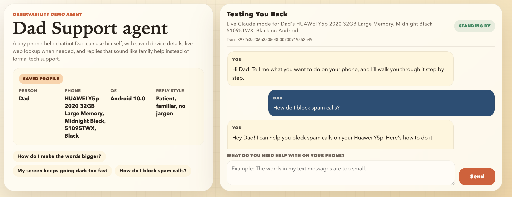

# Dad Tech Support



A small Next.js assistant for patient phone-help conversations. It can reply through the browser UI or through Twilio WhatsApp, uses a saved user profile for context, can trace requests in Langfuse, and supports a `code red` prompt override for broader assistance.

If `ANTHROPIC_API_KEY` is missing, the app still runs in fallback mode so the UI and webhook can be tested without live model credentials.

## Docs

- [architecture.md](./architecture.md) — system overview, component map, deployment shape, and design choices
- [AGENT.md](./AGENT.md) — Codex/operator runbook with human-in-the-loop auth boundaries
- [docs/configuration.md](./docs/configuration.md) — full environment variable and configuration reference
- [render.yaml](./render.yaml) — optional Render deployment blueprint

## Quick start

```bash
cp .env.example .env.local
npm install
npm run dev
```

Open [http://localhost:3000](http://localhost:3000).

## Customize It For Your Own Parents

To adapt this repo for your own family, start with `data/user-profiles.json`.

- Change the saved name, phone model, OS version, carrier, comfort level, and notes.
- Add `phoneNumbers` if you want incoming WhatsApp messages from a specific number to map to that parent automatically.
- Update the prompt copy in Langfuse Prompt Management, or edit `lib/langfuse-prompts.json` for the local fallback prompt.
- Change `DAD_DEFAULT_USER_ID` in `.env.local` if you want a different saved profile to be the default.

## Environment variables

The app reads configuration from `.env` or `.env.local`.

For most setups, the only important variables to think about first are:

- `ANTHROPIC_API_KEY` for live model responses
- `TWILIO_AUTH_TOKEN` if you want to use the WhatsApp webhook
- `DAD_DEFAULT_USER_ID` if you want a different default saved profile

Optional extras:

- Redis or Upstash variables for durable WhatsApp session memory
- Langfuse variables for tracing and prompt management
- WhatsApp-specific model and token settings

See [docs/configuration.md](./docs/configuration.md) for the full variable list and detailed notes.

## Twilio WhatsApp

The repo exposes a Twilio-compatible webhook at `POST /api/whatsapp`.

### Fastest test path: Twilio Sandbox

1. Run the app locally with `npm run dev`.
2. Expose port `3000` with a public tunnel such as `ngrok` or Cloudflare Tunnel.
3. In Twilio Console, open `Messaging > Try it out > Send a WhatsApp message > Sandbox settings`.
4. Set **When a message comes in** to `https://your-public-url/api/whatsapp`.
5. Keep the method as `POST`.
6. From the target phone, send the current sandbox join phrase shown in Twilio Console.
7. Send a normal WhatsApp message and confirm the assistant replies.

Notes:

- Sandbox access is available immediately after the phone sends the join phrase.
- Sandbox membership lasts 3 days, then the phone must rejoin.
- Sandbox is for testing only.

### Matching incoming phone numbers to profiles

If you want a specific WhatsApp number to map to a saved profile, add `phoneNumbers` to that profile in `data/user-profiles.json`:

```json
[
  {
    "id": "dad",
    "name": "Dad",
    "phoneNumbers": ["+491234567890"]
  }
]
```

## Deployment

### Recommended path

Use **Vercel + Upstash Redis**.

Why:

- easiest Next.js hosting path
- public HTTPS by default
- simple environment-variable setup
- easy Redis-backed WhatsApp memory

### Production checklist

1. Push the repo to GitHub.
2. Import it into Vercel.
3. Add the core environment variables.
4. Set `TWILIO_WEBHOOK_URL` to `https://your-domain/api/whatsapp`.
5. Attach Upstash Redis through the Vercel integration.
6. Redeploy once after Redis is attached.
7. Point Twilio Sandbox or your production sender to the same webhook URL.

If you want a coding agent to handle the setup flow, point it to [AGENT.md](./AGENT.md).

### Verify production

Open:

```text
https://your-domain/api/health
```

Expected:

- `"ok": true`
- `sessionStore.backend` is `"redis"` if persistence is configured

Then send a WhatsApp message and a follow-up message to confirm context persists.

## Langfuse

If Langfuse is configured, the app will:

- trace `/api/chat` and `/api/whatsapp`
- record a separate generation span with full input and output
- fetch prompts from Langfuse Prompt Management when available

To sync the local prompt definitions into Langfuse:

```bash
npm run langfuse:sync-prompts
```

## Current limits

- WhatsApp currently handles text messages only
- browser chat history is only in the current browser session
- durable WhatsApp context requires Redis or Upstash
- Twilio Sandbox is a test path, not a production sender

## Deploy QR

Scan to deploy your own dad support agent


