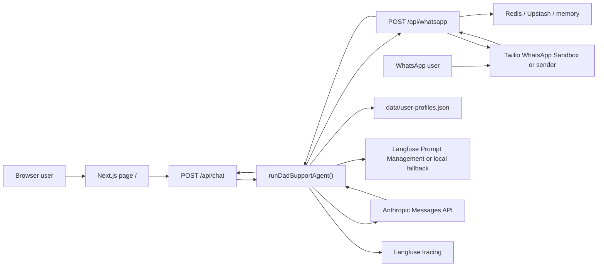
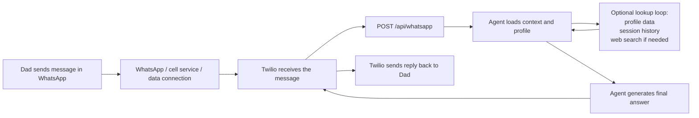

# Architecture

This document explains what the app is built from, how the pieces interact, and why those choices were made.

## Overview

`dad_support_agent` is a small Next.js application that serves two interfaces on top of the same assistant logic:

- a browser chat UI at `/`
- a Twilio-compatible WhatsApp webhook at `POST /api/whatsapp`

Both entrypoints call the same core runtime in `lib/dad-support-agent.ts`. That runtime:

- loads a saved user profile from `data/user-profiles.json`
- selects the active system prompt, optionally from Langfuse Prompt Management
- calls Anthropic's Messages API
- optionally allows Anthropic web search
- returns a concise answer
- records traces and generations in Langfuse

For WhatsApp, short conversation history is persisted per sender so follow-up questions retain context.

## Main technologies

| Technology | Role in the system | Why we chose it |
| --- | --- | --- |
| Next.js 16 + App Router | Web app shell and API routes | One codebase for UI and server endpoints, simple Vercel deployment, minimal infrastructure overhead |
| React 19 | Browser chat UI | Lightweight client state for the demo UI, no extra state library needed |
| TypeScript | Application code | Keeps route contracts, profile shapes, and integration code safer as the app grows |
| Anthropic SDK | Model execution | Direct access to the Messages API and server-side web search tooling |
| Twilio SDK | WhatsApp webhook validation and TwiML responses | Standard way to validate Twilio signatures and generate reply XML |
| Langfuse | Observability and prompt management | We want traces, locked generations, prompt versioning, and a managed system prompt outside hardcoded app text |
| OpenTelemetry Node SDK | Tracing bootstrap | Lets Langfuse receive structured spans from a standard instrumentation layer |
| Redis / Upstash Redis | WhatsApp session memory | Durable, simple, and good enough for short-turn history without designing a full database schema |
| Vercel | Preferred hosting | Lowest-friction production path for a Next.js app with HTTPS and easy environment management |

## System diagram

## Request flows

### Browser chat flow

1. The React UI in `app/page.tsx` collects the user message and local in-browser history.
2. It posts JSON to `POST /api/chat`.
3. `app/api/chat/route.ts` validates the request, creates a `sessionId`, and starts a Langfuse route span.
4. The route calls `runDadSupportAgent()`.
5. The agent loads the selected profile, resolves the active prompt, and calls Anthropic.
6. The result is returned as JSON with the answer, mode, profile summary, and trace id.

### WhatsApp flow

1. The WhatsApp user sends a message to Twilio.
2. Twilio calls `POST /api/whatsapp` with form-encoded webhook data.
3. `app/api/whatsapp/route.ts` validates the Twilio signature using `TWILIO_AUTH_TOKEN`.
4. The route derives a sender-based `sessionId`, loads prior WhatsApp history, and tries to match the phone number to a saved profile.
5. The route calls `runDadSupportAgent()`.
6. The reply is stored back into session history.
7. The route returns TwiML immediately, and Twilio sends that text back to WhatsApp.

This design keeps WhatsApp simple: one inbound webhook request in, one TwiML response out.

### WhatsApp interaction diagram

The diagram below shows the simple end-to-end path for a typical WhatsApp question.

Important note:

- The only "loop" here is the agent gathering what it needs before answering.
- In practice that means using saved profile data, recent session history, and optional web search inside the same request before returning the final reply.

## Component map

### UI layer

- `app/page.tsx`
  - Simple client-side chat surface
  - Holds transient browser conversation state
  - Calls `/api/chat`
- `app/layout.tsx`
  - Root HTML layout and metadata
- `app/globals.css`
  - App styling

### API layer

- `app/api/chat/route.ts`
  - Browser chat endpoint
  - Accepts JSON input and returns JSON output
  - Creates route-level Langfuse observations
- `app/api/whatsapp/route.ts`
  - Twilio webhook endpoint
  - Accepts form-encoded webhook input
  - Validates signatures
  - Returns TwiML XML
- `app/api/health/route.ts`
  - Operational health endpoint
  - Reports whether Redis or memory is active for WhatsApp session storage

### Domain logic

- `lib/dad-support-agent.ts`
  - Central orchestration layer
  - Shared by both chat and WhatsApp
  - Handles prompt mode, model call, fallback mode, generation tracing, and source-link post-processing

### Integration helpers

- `lib/twilio-whatsapp.ts`
  - Extracts Twilio webhook params
  - Reconstructs the public webhook URL
  - Validates `X-Twilio-Signature`
  - Builds TwiML response XML
- `lib/whatsapp-sessions.ts`
  - Stores short WhatsApp history
  - Supports `REDIS_URL`
  - Supports `UPSTASH_REDIS_REST_URL` + `UPSTASH_REDIS_REST_TOKEN`
  - Falls back to in-memory storage if no durable backend is configured
- `lib/profiles.ts`
  - Loads saved user profiles from disk
  - Can resolve a profile by `userId` or by incoming phone number

### Observability and prompts

- `instrumentation.ts`
  - Next.js boot hook for server-side tracing setup
- `lib/langfuse.ts`
  - Initializes OpenTelemetry and Langfuse
  - Optionally instruments the Anthropic SDK automatically
- `lib/langfuse-prompts.ts`
  - Fetches the active prompt from Langfuse Prompt Management
  - Caches it briefly in memory
  - Falls back to local prompt definitions if Langfuse is unavailable
- `lib/langfuse-prompts.json`
  - Local source of truth for fallback prompt templates

### Data

- `data/user-profiles.json`
  - File-based user profile store
  - Good enough for this app because the profile count is tiny and changes rarely

## Runtime behavior

### Shared assistant behavior

The app uses a single assistant core for both channels. That means:

- profile lookup works the same in browser and WhatsApp
- prompt management works the same in browser and WhatsApp
- tracing works the same in browser and WhatsApp
- fallback mode works the same in browser and WhatsApp

The main difference is channel configuration:

- browser chat allows more tokens and enables web search by default
- WhatsApp uses fewer tokens and disables web search by default to keep webhook latency lower

### Prompt behavior

There are two prompt modes:

- default assistant prompt
- `code red` override prompt

If a message starts with `code red`, the app switches to the alternate prompt for that turn. The code-red mode changes the app-level prompt only; it does not bypass model-provider safety controls.

### Fallback mode

If `ANTHROPIC_API_KEY` is missing or the live model call fails, the app returns a local fallback answer instead of crashing. That keeps the UI and basic testing usable even without model credentials.

## Data and persistence choices

### User profiles

We chose a JSON file for profiles because:

- there is only a very small number of profiles
- the data is structured and stable
- the app does not need user-facing profile editing yet
- it avoids introducing a database too early

Tradeoff:

- not ideal once profile count grows or non-technical admins need to edit profile data in a UI

### WhatsApp session history

We chose short-turn Redis storage because:

- WhatsApp needs context across separate webhook calls
- Redis is simpler than introducing a relational schema for lightweight chat memory
- Vercel + Upstash is easy to operate

Current behavior:

- only the last few turns are stored
- history is scoped by WhatsApp sender
- the TTL is configurable with `WHATSAPP_SESSION_TTL_SECONDS`

Tradeoff:

- this is conversation memory, not a long-term knowledge store
- there is no advanced summarization or retrieval layer yet

## Observability architecture

Tracing is intentionally first-class.

The app records:

- route spans for `/api/chat` and `/api/whatsapp`
- a profile lookup tool span
- an agent span for answer generation
- a generation span that locks the effective prompt, inputs, outputs, and token usage
- synthetic `web-search` tool spans derived from Anthropic server-side tool results

Why Langfuse:

- prompt versions can be managed outside the codebase
- generations can be inspected independently from route spans
- input and output can be locked at the generation level
- deployment versions and environments can be compared

Why OpenTelemetry:

- it gives a standard initialization path
- it integrates well with Langfuse's span processor

## Deployment architecture

### Chosen path

The preferred production architecture is:

- GitHub repository
- Vercel-hosted Next.js app
- Upstash Redis attached through the Vercel integration
- Twilio WhatsApp Sandbox or registered sender pointing to the deployed webhook URL

Why this path won:

- minimal ops overhead
- automatic HTTPS
- straightforward environment variable management
- native fit for App Router and API routes
- easy Redis attachment for WhatsApp persistence

### Alternate path

The repo also includes `render.yaml` for Render.

Why we kept it:

- it offers a more traditional always-on service model
- it can be useful if the team later prefers a non-Vercel host

Why it is not the default:

- Vercel is less setup for this exact Next.js use case
- the current Twilio webhook flow works well with Vercel's public HTTPS deploys

## Security and secret handling

Secrets are environment-driven and not part of the repo.

Important secrets:

- `ANTHROPIC_API_KEY`
- `TWILIO_AUTH_TOKEN`
- `LANGFUSE_PUBLIC_KEY`
- `LANGFUSE_SECRET_KEY`

Important design choice:

- authentication, provider login, and secret ownership stay with the human operator
- the agent can wire existing secrets into local or hosted config, but should not own account creation or credential generation

Why:

- it reduces the risk of secret leakage
- it keeps billing and account authority with the human owner
- it matches how browser-based provider consoles actually work in practice

## Why these choices

### Why Next.js instead of separate frontend and backend services

Because this app is small, mostly request-response, and benefits from one deployable unit. Splitting the UI and API would add operational complexity without solving a current problem.

### Why Twilio instead of building directly against WhatsApp APIs first

Because Twilio is the faster path to getting inbound and outbound WhatsApp messaging working, especially in sandbox mode. It also gives webhook handling, sender management, and signature validation in a familiar developer workflow.

### Why Twilio Sandbox first

Because it is the lowest-friction way to validate the end-to-end flow before upgrading billing or registering a production sender.

### Why Langfuse Prompt Management instead of only local prompts

Because prompts are part of behavior, not just code. Managing them in Langfuse allows iteration, versioning, and trace linkage without redeploying for every prompt tweak.

### Why Redis instead of only in-memory conversation history

Because a serverless or restarted process loses in-memory state. WhatsApp follow-up questions need continuity across separate webhook invocations.

## Current limits

- media attachments are not handled yet
- profile data is file-based rather than admin-editable
- there is no persistent browser-chat history outside the current browser session
- WhatsApp memory is short-term only
- Twilio Sandbox is testing-only and requires users to join with a sandbox phrase

## Future extension points

- move user profiles into a database or admin-managed CMS
- support media and richer WhatsApp message types
- add persistent browser session history
- support multiple families or assistants, not only the single `dad` profile
- add message moderation, rate limiting, and abuse controls
- add a production WhatsApp sender after the sandbox flow is proven
